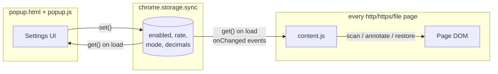

# Architecture (plain JavaScript build)

A deliberately small Manifest V3 extension: two runtime pieces (a content
script and a popup) that never talk to each other directly — all coordination
happens through `chrome.storage.sync`. There is no background service worker,
no bundler, no dependencies: **what is in this repository is exactly what
Chrome executes.**

## This repository's branches

The same extension exists in three implementations so the architectural
trade-offs can be compared directly. Every branch passes the same 28-check
end-to-end suite; behavior is identical down to the formatted string.

| Branch | Implementation | Architecture doc |
| --- | --- | --- |
| `main` (this branch) | Plain JavaScript, zero toolchain | this file |
| `typescript` | Typed modular sources (`src/*.ts`), esbuild → `dist/` | `docs/ARCHITECTURE.md` on that branch |
| `go-wasm` | Conversion core in Go compiled to WebAssembly + JS shell | `docs/ARCHITECTURE.md` on that branch |

`typescript` changes the *source* architecture (modules, types, build step)
while keeping this runtime design; `go-wasm` changes the *runtime*
architecture (two languages, a WASM boundary). This branch is the baseline
both are measured against.

## Runtime topology



## Components

| File | Role |
| --- | --- |
| `manifest.json` | MV3 manifest. Requests only `storage`; injects `content.js` into all frames at `document_idle`. |
| `content.js` | Finds RMB amounts in text nodes, annotates them, keeps annotations in sync with settings and with DOM changes. One self-contained IIFE, ~350 lines. |
| `popup.html` / `popup.js` | Settings editor with live preview and validation. |
| `icons/`, `tools/gen_icons.mjs` | Toolbar icons and the script that renders them (SVG → PNG via headless Chromium). |
| `demo/demo.html` | Manual/automated test page: realistic pricing dashboard plus edge cases and a dynamic-content button. |

## Why plain JavaScript (and what it costs)

**What zero-toolchain buys:**

- **The repo is the artifact.** Clone → Load unpacked. No Node, no
  `npm install`, no build step, nothing to get out of date between source
  and shipped code.
- **Auditability.** What a security-conscious user reads in the repo is
  byte-for-byte what runs in their browser — there is no compiled output to
  trust.
- **Zero dependency surface.** No lockfile, no supply-chain exposure, no
  toolchain versions to keep working.

**What it costs (visible in this codebase):**

- **Duplication instead of imports.** `formatUsd()` exists twice — once in
  `content.js`, once in `popup.js` — because content scripts declared in a
  MV3 manifest are classic scripts, not ES modules, and without a bundler
  the only sharing mechanisms are copy-paste or globals. The two copies must
  be kept in sync by hand. (The `typescript` branch exists partly to show
  this fixed: one `src/format.ts` imported by both entry points.)
- **No compile-time checking.** The settings object's shape, the
  `'append' | 'replace'` mode strings, and every `chrome.*` call are
  enforced only by tests and discipline. A typo like `settings.mode ===
  'repalce'` parses fine and fails silently at runtime.
- **Structure by convention.** `content.js` is organized with banner
  comments (helpers / DOM output / scanner / observer / control) rather than
  module boundaries; nothing stops future edits from tangling those layers.

At ~350 lines with a strong e2e suite, these costs are real but small —
which is exactly why this branch stays plain JS and the typed variant lives
on its own branch.

## Settings model

One flat object, defaulted identically in both scripts:

```js
{ enabled: true, rate: 7, mode: 'append', decimals: 'auto' }
```

- `rate` — RMB per 1 USD; the divisor for every conversion.
- `mode` — `'append'` (badge next to the original) or `'replace'`.
- `decimals` — `'auto'` | `'4'` | `'5'` | `'6'` (always at least 4 places).

The popup writes with `chrome.storage.sync.set`; every page's content script
receives `chrome.storage.onChanged` and reacts without any reload. Using
storage as the bus avoids `tabs`/messaging permissions and makes settings
durable and profile-synced for free.

## content.js pipeline

### 1. Matching

A single regex pass per text node handles both symbol-first and unit-last
forms, plus `万`/`亿` multipliers:

```
(?:¥|￥|\b(?:RMB|CNY))\s*([0-9][0-9,]*(?:\.[0-9]+)?)(?:\s*([万亿]))?   — ¥30.00, CNY 88, ¥3.5万
\b([0-9][0-9,]*(?:\.[0-9]+)?)(?:\s*([万亿]))?\s*(?:元|(?:RMB|CNY)\b)  — 99元, 6 RMB, 3.5万元
```

Word boundaries keep `RMB`/`CNY` from matching inside other words; the
multiplier group is written so that an *absent* multiplier consumes no
trailing whitespace (keeps the annotation flush against the matched price).

### 2. Annotating

Each match is replaced by a small wrapper, and the surrounding text is
preserved as sibling text nodes:

```html
<span class="r2u-wrap" data-cny="30" title="¥30.0000 ≈ $4.2857 (1 USD = 7 RMB)">
  <span class="r2u-orig">¥30.0000</span>
  <span class="r2u-usd">$4.2857</span>
</span>
```

Key properties of this shape:

- **`data-cny` stores the parsed value once.** Rate/mode/decimal changes only
  rewrite the `.r2u-usd` text and toggle `display` on the two inner spans —
  no re-scanning, no re-parsing, O(annotations) per settings change.
- **The original text survives verbatim** in `.r2u-orig`, which is what makes
  *Replace* mode and full restore possible.
- **Styling is inline** on the badge span rather than via an injected
  stylesheet, so annotations render correctly inside open shadow roots where
  a document-level stylesheet cannot reach.

### 3. Scanning

`scan(node)` walks a subtree with a `TreeWalker` that accepts text nodes and
prunes whole element branches early: `SCRIPT`/`STYLE`/form controls/`SVG`,
`contenteditable` regions, and — critically — our own `.r2u-wrap` spans
(prevents re-processing and feedback loops). Text nodes are collected first
and mutated after the walk finishes, since replacing nodes mid-walk would
invalidate the walker. Nodes longer than 20 000 characters are skipped as a
performance guard.

Elements with an open `shadowRoot` are registered as additional scan roots:
each shadow root is scanned, observed, and remembered in a `roots` set so
that `refreshAll()`/`unwrapAll()` can reach annotations inside them.
(Closed shadow roots are unreachable by design — see limitations.)

### 4. Staying current on dynamic pages

One `MutationObserver` (options: `childList`, `characterData`, `subtree`)
watches the document and every registered shadow root:

- Added nodes and changed text nodes are pushed into a `pending` set —
  unless they are, or sit inside, one of our own wrappers, which filters out
  the mutations our own edits generate.
- A 150 ms debounce timer batches bursts (SPA route changes, table renders)
  into a single `flush()`, which re-scans just the queued subtrees.

### 5. Enable / disable lifecycle

- **Disable** disconnects the observer, then `unwrapAll()` replaces every
  wrapper with a plain text node of the original text and calls
  `normalize()` on affected parents, coalescing fragmented text nodes. The
  DOM returns to (functionally) its pre-extension state.
- **Enable** re-observes all known roots and re-scans from `document.body`.

This "leave no trace when off" behavior is why disable isn't merely
`display:none` on the badges.

### 6. Formatting

`formatUsd()` implements the decimals setting. Every amount is printed with
**at least 4 decimal places, rounded** (`minimumFractionDigits: 4`). In
`auto` mode sub-dollar values may extend further — `max(4, 2 − floor(log10(v)))`
digits, capped at 8, i.e. roughly three significant digits — so a sub-cent
price like `¥0.0100 / 1M tokens` shows as `$0.00143` rather than being
flattened to `$0.0014`. Fixed modes pin exactly 4/5/6 decimals. Thousands
separators come from `toLocaleString('en-US')`, whose rounding is standard
round-half-away-from-zero.

## popup.js

Loads settings into the form, saves on every change (rate input debounced
200 ms), and renders a live preview (`¥100 ≈ $14.2857 · ¥1 ≈ $0.1429`) using
its own copy of the formatting rules — see the duplication note above. A rate
that isn't a positive number shows an inline error and is never written to
storage — the content script additionally guards against a non-positive rate,
so a bad value can never produce `Infinity` badges.

## Design decisions

- **No background worker.** Nothing needs to run when no page is open;
  storage events deliver settings changes directly to content scripts.
- **Storage as the message bus.** Fewer permissions, less code, and
  cross-device sync compared to `chrome.tabs.sendMessage` fan-out.
- **Annotate, don't rewrite.** Keeping the RMB text (append mode) avoids
  destroying information; replace mode still retains it in the DOM and
  tooltip.
- **`¥` is treated as RMB.** The sign is shared with JPY; a per-site
  heuristic would guess wrong silently, so the trade-off is documented and
  the kill switch is one click away.
- **Regex over NLP.** Price strings on real pages are highly regular; a
  single pass with explicit boundaries is fast, predictable, and debuggable.

## Testing

- `demo/demo.html` covers every supported format, two negative cases
  (`$`, `€`), and dynamic insertion.
- The extension was verified end-to-end by loading it unpacked into headless
  Chromium (Playwright `launchPersistentContext` with
  `--load-extension`), asserting 28 checks: each conversion value at the
  default rate, non-conversion of other currencies, dynamic-content
  handling, live rate changes, replace mode, disable-restores-text, and
  popup load/save/validation behavior. Settings flips were driven through
  the content script's isolated world via CDP `Runtime.evaluate`. The same
  suite runs unchanged against the `typescript` and `go-wasm` branches.
- `tools/gen_icons.mjs` regenerates the three PNG icons deterministically
  from an inline SVG.

## Known limitations

- **Split-node prices**: `<span>¥</span><span>30</span>` is not detected;
  matching is per-text-node by design (stitching adjacent nodes risks
  corrupting layouts and event handlers on arbitrary sites).
- **Closed shadow roots** cannot be entered by any extension.
- **JPY ambiguity** as described above.
- Shadow roots attached *after* their host subtree was scanned are picked up
  only when something inside them next mutates a watched tree; in practice
  frameworks attach shadow roots before inserting hosts, so this is rare.
