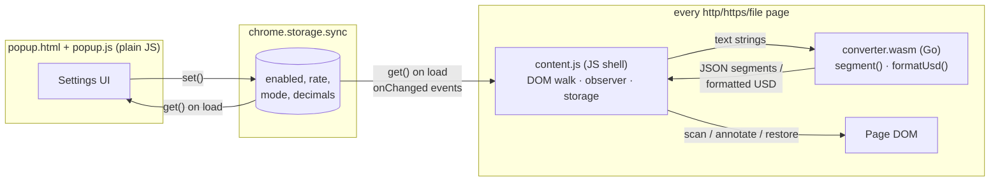

# Architecture (Go → WebAssembly build)

This branch is the **Go/WASM variant**: the conversion logic (price matching,
value parsing, USD formatting) is written in Go (`go/main.go`) and compiled to
`dist/converter.wasm`; a JavaScript shell (`content.js`) owns everything WASM
cannot touch — the DOM, `chrome.storage`, and the MutationObserver. The popup
and the storage-as-bus coordination are unchanged from the JS branch.



## The Go ⇄ JS boundary

WASM modules have no DOM access and no `chrome.*` APIs — every browser
interaction must cross back into JavaScript. The split that keeps the
boundary thin:

- **Go owns pure computation.** `segment(text)` returns the whole input
  split into ordered pieces as JSON — `[{s:"输入价格 "},{s:"¥30.0000",cny:30},
  {s:" / 1M Tokens"}]` — and `formatUsd(value, decimals)` returns a display
  string. Passing *segments* rather than match offsets sidesteps the classic
  cross-language trap: Go regexp reports byte offsets into UTF-8 while
  JavaScript strings index UTF-16 code units, so raw offsets would be wrong
  for any Chinese text. Strings in, strings out — no index math crosses the
  boundary.
- **JS owns the effects.** `content.js` instantiates the module
  (`wasm_exec.js` is Go's runtime shim, injected first), walks text nodes,
  builds the annotation spans from Go's segments, and handles settings and
  mutations exactly like the JS branch.
- **Startup is async.** The shell fetches `dist/converter.wasm` (listed under
  `web_accessible_resources`), instantiates it, waits for Go's exports to
  appear on the global, and only then scans. The manifest carries
  `'wasm-unsafe-eval'` in its CSP for WASM compilation.

## Components

| File | Role |
| --- | --- |
| `manifest.json` | MV3 manifest. Injects `wasm_exec.js` + `content.js`; exposes `dist/converter.wasm` as a web-accessible resource; CSP allows `'wasm-unsafe-eval'`. |
| `go/main.go` | The conversion core: price regex, value parsing (incl. 万/亿), USD formatting. Compiled with `GOOS=js GOARCH=wasm`. |
| `dist/converter.wasm` | The compiled core (~3.3 MB; committed so Load-unpacked works without a Go toolchain). |
| `wasm_exec.js` | Go's official JS runtime shim, vendored from the Go distribution by the build script. |
| `content.js` | JS shell: DOM walking, annotation spans, MutationObserver, storage — delegates matching/formatting to Go. |
| `popup.html` / `popup.js` | Settings editor, plain JS (see the duplication note below). |
| `tools/build_wasm.sh` | Rebuilds the WASM module and refreshes `wasm_exec.js` from the local Go install. |
| `icons/`, `tools/gen_icons.mjs` | Toolbar icons and the script that renders them (SVG → PNG via headless Chromium). |
| `demo/demo.html` | Manual/automated test page: realistic pricing dashboard plus edge cases and a dynamic-content button. |

## Settings model

One flat object, defaulted identically in both scripts:

```js
{ enabled: true, rate: 7, mode: 'append', decimals: 'auto' }
```

- `rate` — RMB per 1 USD; the divisor for every conversion.
- `mode` — `'append'` (badge next to the original) or `'replace'`.
- `decimals` — `'auto'` | `'4'` | `'5'` | `'6'` (always at least 4 places).

The popup writes with `chrome.storage.sync.set`; every page's content script
receives `chrome.storage.onChanged` and reacts without any reload. Using
storage as the bus avoids `tabs`/messaging permissions and makes settings
durable and profile-synced for free.

## content.js pipeline

### 1. Matching (in Go)

`segmentText()` in `go/main.go` runs a single RE2 pass per text node handling
both symbol-first and unit-last forms, plus `万`/`亿` multipliers:

```
(?:¥|￥|\b(?:RMB|CNY))\s*([0-9][0-9,]*(?:\.[0-9]+)?)(?:\s*([万亿]))?   — ¥30.00, CNY 88, ¥3.5万
\b([0-9][0-9,]*(?:\.[0-9]+)?)(?:\s*([万亿]))?\s*(?:元|(?:RMB|CNY)\b)  — 99元, 6 RMB, 3.5万元
```

Word boundaries keep `RMB`/`CNY` from matching inside other words; the
multiplier group is written so that a *absent* multiplier consumes no trailing
whitespace (keeps the annotation flush against the matched price).

### 2. Annotating

Each match is replaced by a small wrapper, and the surrounding text is
preserved as sibling text nodes:

```html
<span class="r2u-wrap" data-cny="30" title="¥30.0000 ≈ $4.2857 (1 USD = 7 RMB)">
  <span class="r2u-orig">¥30.0000</span>
  <span class="r2u-usd">$4.2857</span>
</span>
```

Key properties of this shape:

- **`data-cny` stores the parsed value once.** Rate/mode/decimal changes only
  rewrite the `.r2u-usd` text and toggle `display` on the two inner spans —
  no re-scanning, no re-parsing, O(annotations) per settings change.
- **The original text survives verbatim** in `.r2u-orig`, which is what makes
  *Replace* mode and full restore possible.
- **Styling is inline** on the badge span rather than via an injected
  stylesheet, so annotations render correctly inside open shadow roots where
  a document-level stylesheet cannot reach.

### 3. Scanning

`scan(node)` walks a subtree with a `TreeWalker` that accepts text nodes and
prunes whole element branches early: `SCRIPT`/`STYLE`/form controls/`SVG`,
`contenteditable` regions, and — critically — our own `.r2u-wrap` spans
(prevents re-processing and feedback loops). Text nodes are collected first
and mutated after the walk finishes, since replacing nodes mid-walk would
invalidate the walker. Nodes longer than 20 000 characters are skipped as a
performance guard.

Elements with an open `shadowRoot` are registered as additional scan roots:
each shadow root is scanned, observed, and remembered in a `roots` set so
that `refreshAll()`/`unwrapAll()` can reach annotations inside them.
(Closed shadow roots are unreachable by design — see limitations.)

### 4. Staying current on dynamic pages

One `MutationObserver` (options: `childList`, `characterData`, `subtree`)
watches the document and every registered shadow root:

- Added nodes and changed text nodes are pushed into a `pending` set —
  unless they are, or sit inside, one of our own wrappers, which filters out
  the mutations our own edits generate.
- A 150 ms debounce timer batches bursts (SPA route changes, table renders)
  into a single `flush()`, which re-scans just the queued subtrees.

### 5. Enable / disable lifecycle

- **Disable** disconnects the observer, then `unwrapAll()` replaces every
  wrapper with a plain text node of the original text and calls
  `normalize()` on affected parents, coalescing fragmented text nodes. The
  DOM returns to (functionally) its pre-extension state.
- **Enable** re-observes all known roots and re-scans from `document.body`.

This "leave no trace when off" behavior is why disable isn't merely
`display:none` on the badges.

### 6. Formatting (in Go)

`formatUsd()` in `go/main.go` implements the decimals setting. Every amount
is printed with **at least 4 decimal places, rounded**. In `auto` mode
sub-dollar values may extend further — `max(4, 2 − floor(log10(v)))` digits,
capped at 8, i.e. roughly three significant digits — so a sub-cent price like
`¥0.0100 / 1M tokens` shows as `$0.00143` rather than being flattened to
`$0.0014`. Fixed modes pin exactly 4/5/6 decimals. The implementation is
`strconv.FormatFloat` plus hand-rolled zero-trimming and thousands
separators, written to produce byte-identical output to the JS branch's
`toLocaleString('en-US')` — verified by running the same e2e expectations
against both branches.

## popup.js

Loads settings into the form, saves on every change (rate input debounced
200 ms), and renders a live preview (`¥100 ≈ $14.2857 · ¥1 ≈ $0.1429`). A rate
that isn't a positive number shows an inline error and is never written to
storage — the content script additionally guards against a non-positive rate,
so a bad value can never produce `Infinity` badges.

**Deliberate duplication:** the popup keeps its own ~15-line JS `formatUsd`
for the preview instead of loading the 3.3 MB Go module on every popup open.
That means the formatting rules exist in two languages on this branch — the
exact kind of drift the TypeScript branch eliminates with a shared module,
and an honest illustration of a WASM-architecture cost: sharing tiny logic
across contexts stops being free.

## Costs of the WASM architecture

Compared to the plain-JS and TypeScript branches (identical behavior):

- **Payload**: `converter.wasm` is ~3.3 MB (a minimal Go runtime ships inside
  every module; TinyGo would cut this to hundreds of KB at the cost of a
  second toolchain). The JS branches total ~10 KB.
- **Startup**: instantiation adds tens of milliseconds per page before the
  first scan; the JS branches scan immediately.
- **Call overhead**: every text node costs a JS→WASM→JS round-trip plus JSON
  serialization. Fine at page scale, but the boundary tax means WASM only
  pays off when the computation *behind* the boundary is heavy — parsing
  megabytes, cryptography, image work — which a price regex is not.
- **Toolchain**: contributors need Go (only to modify the core; the compiled
  module is committed).

The reason to pick this architecture is reusing an existing Go/Rust/C++
codebase or doing genuinely heavy computation — not line-level logic like
this extension's, which is exactly why the difference is instructive.

## Design decisions

- **No background worker.** Nothing needs to run when no page is open;
  storage events deliver settings changes directly to content scripts.
- **Storage as the message bus.** Fewer permissions, less code, and
  cross-device sync compared to `chrome.tabs.sendMessage` fan-out.
- **Annotate, don't rewrite.** Keeping the RMB text (append mode) avoids
  destroying information; replace mode still retains it in the DOM and
  tooltip.
- **`¥` is treated as RMB.** The sign is shared with JPY; a per-site
  heuristic would guess wrong silently, so the trade-off is documented and
  the kill switch is one click away.
- **Regex over NLP.** Price strings on real pages are highly regular; a
  single pass with explicit boundaries is fast, predictable, and debuggable.

## Testing

- `demo/demo.html` covers every supported format, two negative cases
  (`$`, `€`), and dynamic insertion.
- The extension was verified end-to-end by loading it unpacked into headless
  Chromium (Playwright `launchPersistentContext` with
  `--load-extension`), asserting 28 checks: each conversion value at the
  default rate, non-conversion of other currencies, dynamic-content
  handling, live rate changes, replace mode, disable-restores-text, and
  popup load/save/validation behavior. Settings flips were driven through
  the content script's isolated world via CDP `Runtime.evaluate`.
- `tools/gen_icons.mjs` regenerates the three PNG icons deterministically
  from an inline SVG.

## Known limitations

- **Split-node prices**: `<span>¥</span><span>30</span>` is not detected;
  matching is per-text-node by design (stitching adjacent nodes risks
  corrupting layouts and event handlers on arbitrary sites).
- **Closed shadow roots** cannot be entered by any extension.
- **JPY ambiguity** as described above.
- Shadow roots attached *after* their host subtree was scanned are picked up
  only when something inside them next mutates a watched tree; in practice
  frameworks attach shadow roots before inserting hosts, so this is rare.
