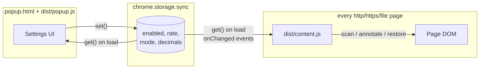
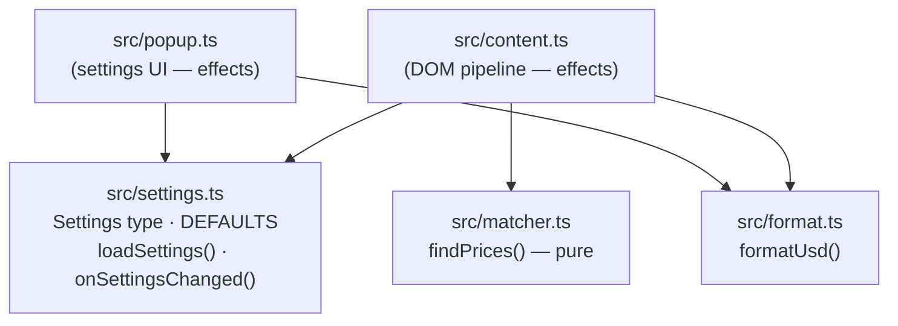

# Architecture (TypeScript build)

A deliberately small Manifest V3 extension: two runtime pieces (a content
script and a popup) that never talk to each other directly — all coordination
happens through `chrome.storage.sync`. There is no background service worker.

This branch is the **TypeScript variant**. The *runtime* architecture is
identical to the plain-JS `main` branch; what changes is the *source*
architecture: code lives in `src/` as strict-mode ES modules with shared
logic factored into imported modules, and esbuild bundles each entry point
into the plain-JS files Chrome actually loads (`dist/content.js`,
`dist/popup.js`).

## This repository's branches

| Branch | Implementation | What it demonstrates |
| --- | --- | --- |
| `main` | Plain JavaScript, zero toolchain | The baseline: repo == artifact |
| `typescript` (this branch) | Typed modular sources + esbuild | Source architecture: modules, compile-time checking |
| `go-wasm` | Go core compiled to WASM + JS shell | Runtime architecture: a language boundary |

Every branch passes the same 28-check end-to-end suite; behavior is
identical down to the formatted string.

## Runtime topology

Unchanged from `main` — the build step disappears at runtime:



## Source architecture

The interesting part of this branch is the module graph:



The split follows one rule: **pure logic in leaf modules, effects in entry
points.**

- `src/settings.ts` — the single authority on the settings schema: the
  `Settings` interface, the `DisplayMode` and `DecimalsSetting` union types,
  `DEFAULTS`, and typed helpers (`loadSettings()`, `onSettingsChanged()`)
  that wrap `chrome.storage.sync`. Both entry points import it, so there is
  exactly one definition of what a valid settings object is.
- `src/format.ts` — `formatUsd()`. On `main` this function is copy-pasted
  into `content.js` *and* `popup.js` and kept in sync by hand; here it exists
  once and both entry points import it. This is the concrete duplication the
  branch eliminates.
- `src/matcher.ts` — `findPrices(text): PriceMatch[]`. Pure string → data,
  no DOM types anywhere in the file, which makes the trickiest logic (the
  price regex and value parsing) unit-testable without a browser.
- `src/content.ts` / `src/popup.ts` — the effectful shells: DOM walking,
  MutationObserver, storage subscriptions, form wiring. They contain no
  conversion logic of their own.

## What the type system buys (concretely)

- **Invalid settings states are unrepresentable.** `mode` is
  `'append' | 'replace'`, `decimals` is `'auto' | '4' | '5' | '6'`. A typo
  like `settings.mode === 'repalce'` — which the JS branch would silently
  accept — is a compile error. Adding a new decimals option means changing
  the `DecimalsSetting` union, and the compiler then points at every
  consumer that needs to handle it.
- **The `chrome.*` surface is typed** via `@types/chrome`: wrong callback
  signatures, misspelled API names, and wrong argument shapes fail the
  build instead of failing on a user's machine.
- **Strictness options do real work here.** `strict` plus
  `noUncheckedIndexedAccess` forces the matcher to handle `undefined` regex
  capture groups (`m[1] ?? m[3]`) — exactly the case the two-branch regex
  produces — and DOM lookups are `HTMLElement | null`, so every
  `querySelector` result is checked before use.
- **Honest cost note:** typed wrappers meet reality at the storage API —
  `@types/chrome` wants an index-signature object for `get()` defaults, so
  `settings.ts` contains the branch's single `as unknown as` cast, localized
  and commented. Type safety at boundaries is a negotiation, not magic.

## Build pipeline

```
src/*.ts ──tsc --noEmit (strict typecheck)──▶ errors fail the build
src/content.ts ─┐
                ├─ esbuild --bundle --format=iife ──▶ dist/content.js, dist/popup.js
src/popup.ts  ──┘
```

Two tools on purpose, because they do different jobs:

- **esbuild** bundles and strips types but performs *no type checking* — it
  is the fast emit path (`npm run watch` for instant rebuilds on save).
- **tsc --noEmit** is the checker. `npm run build` runs it first, so a type
  error fails the build before anything is emitted.

Choices worth explaining:

- **`--format=iife`** — MV3 `content_scripts` are injected as classic
  scripts, not ES modules, so the bundle must be a self-contained
  IIFE. Imports are inlined at build time; the emitted file has the same
  shape (and roughly the same ~10 KB size) as the hand-written `main`
  branch. Nothing module-related survives to runtime.
- **`--target=chrome110`** — output syntax floor; no polyfills needed since
  the only runtime is a modern Chromium.
- **No minification** — the emitted code stays readable so a reviewer can
  still audit what actually runs, keeping most of `main`'s auditability
  story.
- **`dist/` is committed** so Load-unpacked works without Node. The
  tradeoff is rebuild discipline: edit `src/`, run `npm run build`, commit
  both. (A CI check like `npm run build && git diff --exit-code dist` would
  enforce freshness; overkill at this repo's size, worth it with more
  contributors.)

## Components

| File | Role |
| --- | --- |
| `manifest.json` | MV3 manifest. Requests only `storage`; injects `dist/content.js` into all frames at `document_idle`. |
| `src/settings.ts` | Settings schema authority + typed storage helpers. |
| `src/format.ts` | Shared `formatUsd()` — one implementation for both entry points. |
| `src/matcher.ts` | Pure text→price matching (`findPrices()`); no DOM dependency. |
| `src/content.ts` | DOM pipeline: scan, annotate, observe, restore. |
| `popup.html` / `src/popup.ts` | Settings editor with live preview and validation. |
| `dist/` | esbuild output — the JS Chrome loads. Committed so Load-unpacked works without Node. |
| `tsconfig.json` / `package.json` | Strict compiler config; `npm run build` = typecheck + bundle. |
| `icons/`, `tools/gen_icons.mjs` | Toolbar icons and the script that renders them (SVG → PNG via headless Chromium). |
| `demo/demo.html` | Manual/automated test page: realistic pricing dashboard plus edge cases and a dynamic-content button. |

## Settings model

One flat object, whose shape is now enforced by the `Settings` interface in
`src/settings.ts`:

```ts
interface Settings {
  enabled: boolean;
  rate: number;              // CNY per 1 USD — the divisor for every conversion
  mode: DisplayMode;         // 'append' | 'replace'
  decimals: DecimalsSetting; // 'auto' | '4' | '5' | '6' — always at least 4
}
// DEFAULTS: { enabled: true, rate: 7, mode: 'append', decimals: 'auto' }
```

The popup writes with `chrome.storage.sync.set`; every page's content script
receives `chrome.storage.onChanged` (via the typed `onSettingsChanged()`
helper) and reacts without any reload. Using storage as the bus avoids
`tabs`/messaging permissions and makes settings durable and profile-synced
for free.

## Content pipeline (src/content.ts + src/matcher.ts)

### 1. Matching

`findPrices()` in `src/matcher.ts` runs a single regex pass per text node,
handling both symbol-first and unit-last forms, plus `万`/`亿` multipliers:

```
(?:¥|￥|\b(?:RMB|CNY))\s*([0-9][0-9,]*(?:\.[0-9]+)?)(?:\s*([万亿]))?   — ¥30.00, CNY 88, ¥3.5万
\b([0-9][0-9,]*(?:\.[0-9]+)?)(?:\s*([万亿]))?\s*(?:元|(?:RMB|CNY)\b)  — 99元, 6 RMB, 3.5万元
```

Word boundaries keep `RMB`/`CNY` from matching inside other words; the
multiplier group is written so that an *absent* multiplier consumes no
trailing whitespace (keeps the annotation flush against the matched price).
It returns typed `PriceMatch { index, text, cny }` records; `content.ts`
consumes those to build DOM — the regex itself never appears in the entry
point.

### 2. Annotating

Each match is replaced by a small wrapper, and the surrounding text is
preserved as sibling text nodes:

```html
<span class="r2u-wrap" data-cny="30" title="¥30.0000 ≈ $4.2857 (1 USD = 7 RMB)">
  <span class="r2u-orig">¥30.0000</span>
  <span class="r2u-usd">$4.2857</span>
</span>
```

Key properties of this shape:

- **`data-cny` stores the parsed value once.** Rate/mode/decimal changes only
  rewrite the `.r2u-usd` text and toggle `display` on the two inner spans —
  no re-scanning, no re-parsing, O(annotations) per settings change.
- **The original text survives verbatim** in `.r2u-orig`, which is what makes
  *Replace* mode and full restore possible.
- **Styling is inline** on the badge span rather than via an injected
  stylesheet, so annotations render correctly inside open shadow roots where
  a document-level stylesheet cannot reach.

### 3. Scanning

`scan(node)` walks a subtree with a `TreeWalker` that accepts text nodes and
prunes whole element branches early: `SCRIPT`/`STYLE`/form controls/`SVG`,
`contenteditable` regions, and — critically — our own `.r2u-wrap` spans
(prevents re-processing and feedback loops). Text nodes are collected first
and mutated after the walk finishes, since replacing nodes mid-walk would
invalidate the walker. Nodes longer than 20 000 characters are skipped as a
performance guard.

Elements with an open `shadowRoot` are registered as additional scan roots:
each shadow root is scanned, observed, and remembered in a
`Set<Document | ShadowRoot>` so that `refreshAll()`/`unwrapAll()` can reach
annotations inside them. (Closed shadow roots are unreachable by design —
see limitations.)

### 4. Staying current on dynamic pages

One `MutationObserver` (options: `childList`, `characterData`, `subtree`)
watches the document and every registered shadow root:

- Added nodes and changed text nodes are pushed into a `pending` set —
  unless they are, or sit inside, one of our own wrappers, which filters out
  the mutations our own edits generate.
- A 150 ms debounce timer batches bursts (SPA route changes, table renders)
  into a single `flush()`, which re-scans just the queued subtrees.

### 5. Enable / disable lifecycle

- **Disable** disconnects the observer, then `unwrapAll()` replaces every
  wrapper with a plain text node of the original text and calls
  `normalize()` on affected parents, coalescing fragmented text nodes. The
  DOM returns to (functionally) its pre-extension state.
- **Enable** re-observes all known roots and re-scans from `document.body`.

This "leave no trace when off" behavior is why disable isn't merely
`display:none` on the badges.

### 6. Formatting

`formatUsd()` in the shared `src/format.ts` implements the decimals setting.
Every amount is printed with **at least 4 decimal places, rounded**
(`minimumFractionDigits: 4`). In `auto` mode sub-dollar values may extend
further — `max(4, 2 − floor(log10(v)))` digits, capped at 8, i.e. roughly
three significant digits — so a sub-cent price like `¥0.0100 / 1M tokens`
shows as `$0.00143` rather than being flattened to `$0.0014`. Fixed modes pin
exactly 4/5/6 decimals. Thousands separators come from
`toLocaleString('en-US')`, whose rounding is standard
round-half-away-from-zero.

## Popup (src/popup.ts)

Loads settings through the shared `loadSettings()` helper, saves on every
change (rate input debounced 200 ms), and renders a live preview
(`¥100 ≈ $14.2857 · ¥1 ≈ $0.1429`) using the *same imported* `formatUsd` as
the content script — preview and page can no longer drift apart, which is the
point of this branch. A rate that isn't a positive number shows an inline
error and is never written to storage — the content script additionally
guards against a non-positive rate, so a bad value can never produce
`Infinity` badges.

## Design decisions

- **No background worker.** Nothing needs to run when no page is open;
  storage events deliver settings changes directly to content scripts.
- **Storage as the message bus.** Fewer permissions, less code, and
  cross-device sync compared to `chrome.tabs.sendMessage` fan-out.
- **Pure logic in leaf modules, effects in entry points.** `matcher.ts` and
  `format.ts` import nothing and touch nothing; testable in isolation.
- **esbuild over heavier tooling.** No framework, two entry points, no CSS
  pipeline: a single fast bundler plus `tsc` for checking beats a
  Vite/webpack setup this repo doesn't need.
- **Annotate, don't rewrite / `¥` treated as RMB / regex over NLP** — same
  runtime decisions as `main`; see that branch's doc for the rationale.

## Testing

- `demo/demo.html` covers every supported format, two negative cases
  (`$`, `€`), and dynamic insertion.
- The built extension (`dist/`) was verified end-to-end by loading it
  unpacked into headless Chromium (Playwright `launchPersistentContext` with
  `--load-extension`), asserting 28 checks: each conversion value at the
  default rate, non-conversion of other currencies, dynamic-content
  handling, live rate changes, replace mode, disable-restores-text, and
  popup load/save/validation behavior. Settings flips were driven through
  the content script's isolated world via CDP `Runtime.evaluate`. The same
  suite runs unchanged against `main` and `go-wasm`.
- The module split also makes `matcher.ts`/`format.ts` unit-testable without
  a browser — the natural place to add fast tests if the format list grows.

## Known limitations

- **Split-node prices**: `<span>¥</span><span>30</span>` is not detected;
  matching is per-text-node by design (stitching adjacent nodes risks
  corrupting layouts and event handlers on arbitrary sites).
- **Closed shadow roots** cannot be entered by any extension.
- **JPY ambiguity**: `¥` is assumed to mean RMB; the toggle is the escape
  hatch on JPY pages.
- Shadow roots attached *after* their host subtree was scanned are picked up
  only when something inside them next mutates a watched tree; in practice
  frameworks attach shadow roots before inserting hosts, so this is rare.
- **Build-freshness risk**: `dist/` can lag `src/` if a contributor forgets
  `npm run build`; enforceable with a CI diff check when that starts to
  matter.
